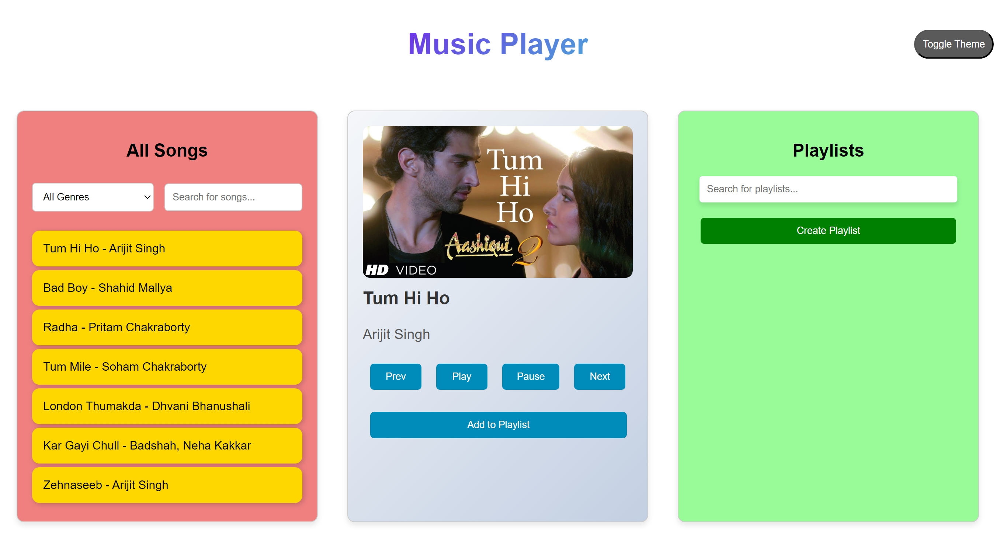

# Music Player Application

## Overview

The Music Player Application allows users to play locally stored songs, create and manage playlists, and dynamically change the application's theme between light and dark modes. It provides a user-friendly interface to filter songs by genre, search for specific songs, and manage playlists efficiently.

## Features

- **Play Locally Stored Songs:** Play songs stored locally on your device.
- **Create and Manage Playlists:** Create playlists, add songs to them, and manage their content.
- **Dynamic Theme Toggle:** Switch between light and dark themes.
- **Song Filtering:** Filter songs by genre.
- **Search Songs:** Search for specific songs within the application.
- **Search Playlists:** Search for specific playlists.
- **Control Playback:** Play, pause, and navigate between songs using playback controls.
- **Remove Songs from Playlists:** Remove songs from playlists, and if a playlist becomes empty, it is automatically deleted.

## How to Use

### 1. Play a Song

- Select a song from the "All Songs" list by clicking on it.
- The selected song will be displayed in the Song Card, and it will start playing automatically.

### 2. Playback Controls

- **Play:** Click the "Play" button to play or resume the current song.
- **Pause:** Click the "Pause" button to pause the current song.
- **Next:** Click the "Next" button to play the next song in the list.
- **Prev:** Click the "Prev" button to play the previous song in the list.

### 3. Create a Playlist

- Click the "Create Playlist" button in the Playlist section.
- Enter a name for the new playlist when prompted.
- The new playlist will be created and displayed in the Playlist section.

### 4. Add a Song to a Playlist

- While a song is selected in the Song Card, click the "Add to Playlist" button.
- Enter the name of the playlist to which you want to add the song when prompted.
- The song will be added to the specified playlist.

### 5. Manage Playlists

- **View Playlist Songs:** Click on a playlist name in the Playlist section to view its songs.
- **Remove Song from Playlist:** Click the "Remove" button next to a song in a playlist to remove it. If the playlist becomes empty, it will be automatically deleted.
- **Search Playlists:** Use the search bar in the Playlist section to search for specific playlists by name.

### 6. Filter and Search Songs

- **Filter by Genre:** Use the dropdown menu in the "All Songs" section to filter songs by genre.
- **Search Songs:** Use the search bar in the "All Songs" section to search for specific songs by name.

### 7. Toggle Theme

- Click the "Toggle Theme" button in the header to switch between light and dark themes.

## File Structure

- **index.html:** The main HTML file that contains the structure of the application.
- **style.css:** The CSS file that contains the styles for the application.
- **script.js:** The JavaScript file that contains the logic and functionality of the application.
- **assets:** A directory that contains the song image files and other assets.

## Setup

1. Clone the repository or download the source code.
2. Open the `index.html` file in a web browser to launch the application.

## Future Enhancements

- Add support for different audio formats.
- Implement additional playback controls such as shuffle and repeat.
- Allow users to edit playlist names.
- Provide options for sorting songs by different criteria.

## Acknowledgments

This Music Player Application is developed to provide an ad-free and customizable music listening experience. Enjoy your music without interruptions!
